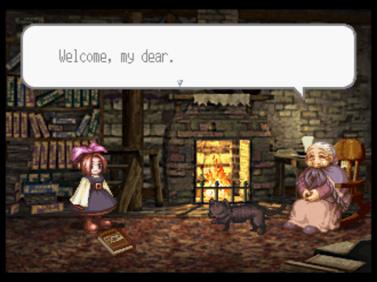
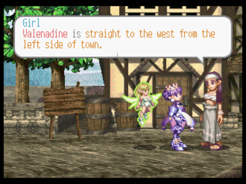
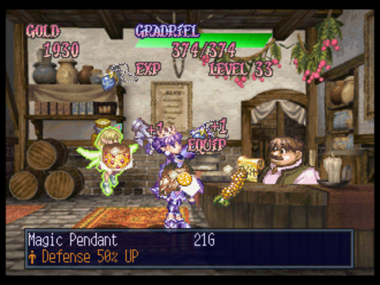

# Princess Crown Translation GPL Edition

[old readme here](readme.txt.old)

**P.N.: reportedly CyberWarriorX and SamIAm are still working privately on this project, and since this was forked many years ago it does not reflect the current status of their project.
Btw since this was originally [released with a GPL-2.0 license](https://github.com/eadmaster/pcrown/blob/master/LICENSE), i'd like to exercise my right to keep working on this and make improvements.**

## Current status

 - all story events, items and names translated
   - using a fixed-width/monospaced font, with condensed spaces (not VWF)
 - [all doorway signs are translated](https://github.com/eadmaster/pcrown/issues/5)
   - some were shortened to fit into the available space, or need alignment fixes
 - all book/scenarios fully tested and crash-free
   - 2 cutscenes have reduced dialogues to bypass softlocks: https://github.com/eadmaster/pcrown/issues/30  https://github.com/eadmaster/pcrown/issues/88

## [FAQs](https://github.com/eadmaster/pcrown/wiki/FAQs)

## [Extras](https://github.com/eadmaster/pcrown/wiki/Extras)

## Preview

    

## Patch instructions (bin format)

1. obtain a game image matching [these hashes](http://redump.org/disc/4901/), and extract it
2. grab the latest xdelta patch from the [Releases section](https://github.com/eadmaster/pcrown/releases/latest/download/Princess.Crown.Japan.1M.Track.01.bin.xdelta).
3. visit [Rom Patcher JS](https://www.marcrobledo.com/RomPatcher.js/)
4. select `Princess Crown (Japan) (1M) (Track 01).bin` as ROM file
5. select `Princess.Crown.Japan.1M.Track.01.bin.xdelta` as Patch file
6. click "Apply patch" and save in the same folder without changing the filename: `Princess Crown (Japan) (1M) (Track 01) (patched).bin`
7. download and use [this cue sheet](https://github.com/eadmaster/pcrown/blob/master/src/buildcd/Princess%20Crown%20(Japan)%20(1M)%20(English).cue) to play the game.

## Patch instructions (iso format)

1. obtain a game image matching [these hashes](http://redump.org/disc/4901/), and extract it
2. download and execute one of these patching scripts in the same folder:
 
  - [for Windows](https://raw.githubusercontent.com/eadmaster/pcrown/refs/heads/master/src/buildcd/_patch_eng.bat)
    - [old offline patcher](https://github.com/eadmaster/pcrown/releases/download/v0.3/Princess.Crown.ez.Windows.patching.script.zip)
  - [for Linux](https://raw.githubusercontent.com/eadmaster/pcrown/refs/heads/master/src/buildcd/_patch_eng.sh)

## Contributions
 
Issues and PRs are currently restricted to contributors to avoid spamming/trolling and keep things easy to manage for me.

Contact me via discord or forums if you can contribute or have issues to report (please read the [FAQs](https://github.com/eadmaster/pcrown/wiki/FAQs) first):

 - [SegaXtreme](https://segaxtreme.net/members/eadmaster.30323/)
 - [GBAtemp](https://gbatemp.net/members/eadmaster.52646/)
 - [Romhacking.net](https://www.romhacking.net/forum/index.php?action=profile;u=13104)

**P.N.: any bit contributed will be re-shared in this repo under the terms of GPL-2.0.**

# New contributors/Special thanks

 - [paul-met](https://github.com/paul-met) ([text spacing and dialog fixes](https://github.com/eadmaster/pcrown/issues/1), [main font](https://github.com/eadmaster/pcrown/issues/98)), [gfx enhancements in the EX build](https://github.com/eadmaster/pcrown/issues/18))
 - [MADevil](https://www.twitch.tv/madevil/), [RetroBorgo](https://www.twitch.tv/retroborgo/)  (playtesting and bug reports)
 - [MiYakuGaming](https://github.com/MiYakuGaming/) ([missing translation parts and corrections](https://github.com/eadmaster/pcrown/issues/4))
 - [Malenko](https://segaxtreme.net/members/malenko.22808/) (gfx hacking help)
 - [derek](https://github.com/DerekPascarella) ([Saturn-4bpp-Graphics-Converter script](https://github.com/DerekPascarella/Saturn-4bpp-Graphics-Converter/))
 - [Mentil](https://github.com/mentill) (lot of Engrish and script fixes, gfx hacking)
 